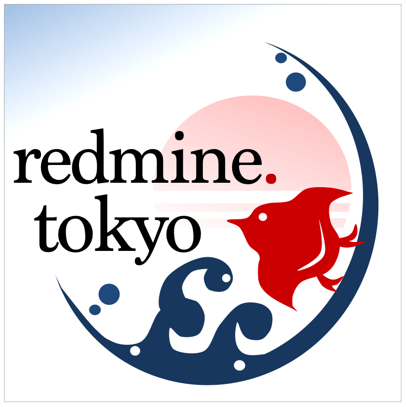

  

# Redmine Tokyo Theme

[redmine.tokyo](https://redmine.tokyo/) コミュニティで使用されているテーマです

## 使い方

1. このリポジトリをクローンまたはダウンロードします
2. Redmine インストールディレクトリの `themes/redmine_tokyo_theme` にコピーします
3. Redmine を再起動後、**管理 → 設定 → 表示** から「Redmine Tokyo Theme」を選択

## English Summary

Redmine Tokyo Theme is the official theme used by the [Redmine Tokyo](https://redmine.tokyo/) user community. The theme is built with plain static files (no build process required), making it easy to install and compatible with multiple Redmine versions. Simply copy to `themes/redmine_tokyo_theme` in your Redmine installation and select it from the administration settings.

## ライセンス 📄

このプロジェクトは MIT ライセンスの下で公開されています。Redmine Tokyo コミュニティによってメンテナンスされており、自由に使用・改変・再配布が可能です。

MIT License - 詳細は [LICENSE](LICENSE) ファイルをご覧ください。
